# MCART As-Built Architecture Diagrams

**Status:** Phase 0 — **Implemented** baseline only  
**Audience:** CTO / prospective clients  
**Companion:** [modernization-assessment.md](modernization-assessment.md) PART 12  

These diagrams match the repository. Do **not** use aspirational draw.io artifacts (Razorpay, Kafka, HPA everywhere) as “current” without the [diagram errata](diagram-errata.md) label.

Honesty labels: **Implemented** | **Designed but not currently implemented** | **Proposed modernization**

---

## Diagram 1 — System context (**Implemented**)

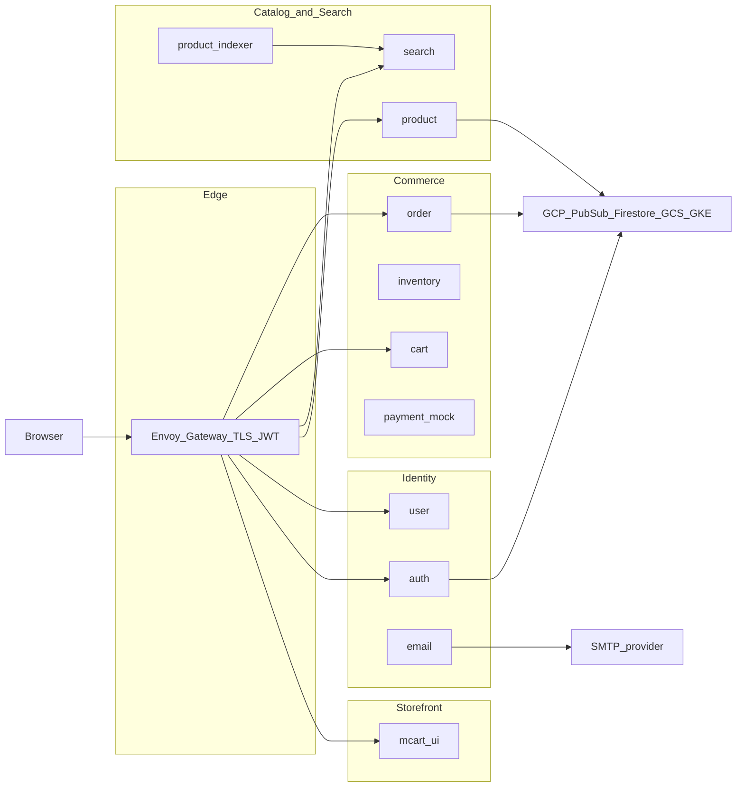

**Talking points:** Payment and email are **not** on public HTTPRoutes (cluster-internal / Pub/Sub). Payment is a **simulated** provider.

---

## Diagram 2 — Container / service map + datastores (**Implemented**)

*Priority diagram #1 for time-limited decks.*

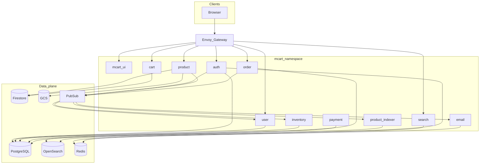

| Store | Owners |
|-------|--------|
| PostgreSQL | auth, user, inventory, payment, order |
| Firestore | product, cart |
| OpenSearch | search (read), product-indexer (write) |
| Redis | auth (tokens/lockout), email (order-paid dedupe) |
| GCS | product images |
| Pub/Sub | async integration bus |

---

## Diagram 3 — Sync vs async overlay (**Implemented**)

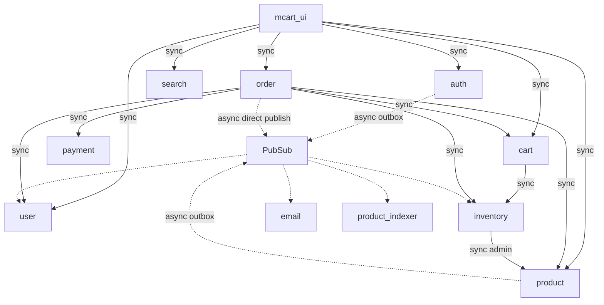

**Talking points:** Sync where the customer needs an immediate response. Async for signup fan-out, catalog fan-out, and email. Order → payment remains sync today (Case Study 1 baseline).

---

## Diagram 4 — Checkout sequence as-built (**Implemented**)

*Priority diagram #2 for time-limited decks.*

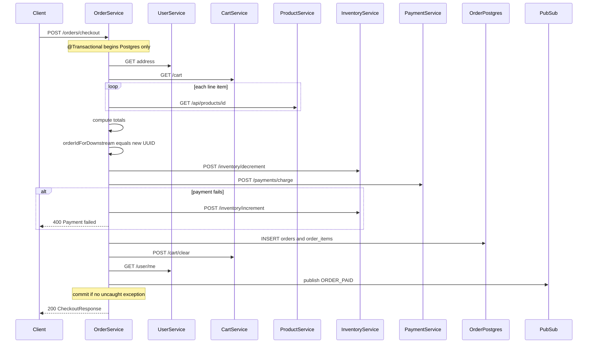

**Honesty:** Not a Saga. Compensation exists only for payment failure → inventory increment. Mock payment — *simulated for demonstration purposes.*

---

## Diagram 5 — Checkout failure windows (**Implemented**)

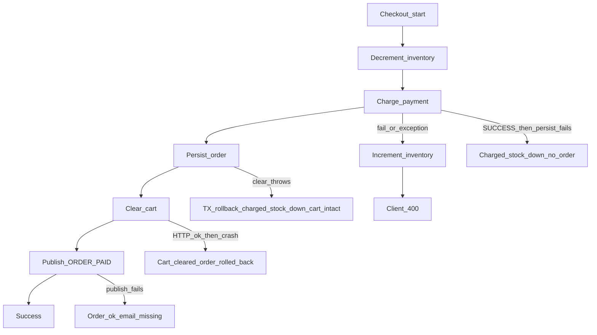

| Window | Inventory | Payment | Order | Cart | Handled today? |
|--------|-----------|---------|-------|------|----------------|
| Payment FAIL | Restored if increment OK | FAILED or none | None | Intact | Partial |
| Payment OK, persist FAIL | Decremented | SUCCESS | None | Intact | **No** |
| Persist OK, clear FAIL | Decremented | SUCCESS | Rolled back | Intact | **No** |
| Clear OK, crash before commit | Decremented | SUCCESS | Rolled back | **Cleared** | **No** |
| Publish FAIL | Decremented | SUCCESS | Committed | Cleared | Soft (no email) |
| Duplicate checkout | Double decrement risk | Double charge risk | Possible double order | Cleared after first | **No** idempotency |

---

## Diagram 6 — Signup / outbox sequence (**Implemented**)

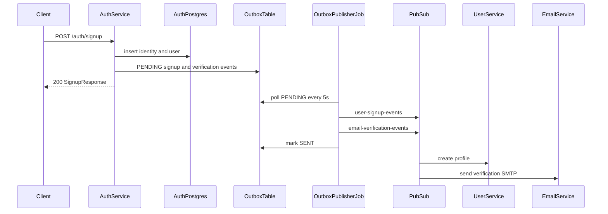

**Talking points:** Signup does **not** call user service synchronously. Outbox is **Implemented** in auth (Postgres). FAILED outbox rows are not auto-retried (gap).

---

## Diagram 7 — Product → index sequence (**Implemented**)

*Priority diagram #3 for time-limited decks.*

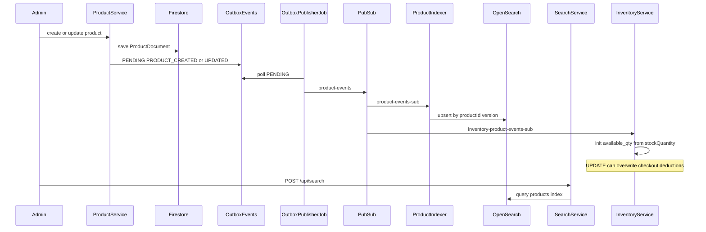

**Talking points:** Eventual consistency for search is intentional. Inventory consuming catalog updates is correct for create/delete; overwriting `available_qty` on UPDATE is Case Study 2.

---

## Diagram 8 — Data ownership map (**Implemented**)

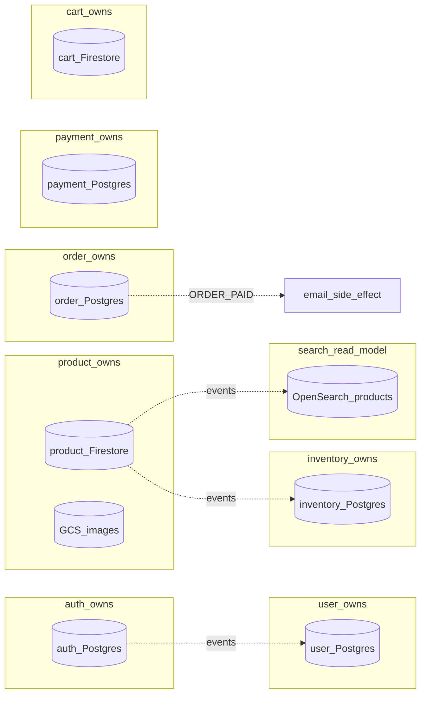

| Boundary | Rule today |
|----------|------------|
| Auth vs User | Separate DBs; linked by Pub/Sub, not shared schema |
| Product vs Inventory | Separate stores; **do not** treat catalog `stockQuantity` as live stock after checkout starts |
| Order vs Payment | Two IDs: `orderIdForDownstream` vs `orders.order_id` — no FK |
| Search | Read model only; never source of truth for price/stock |

---

## Diagram 9 — Edge security (**Implemented**)

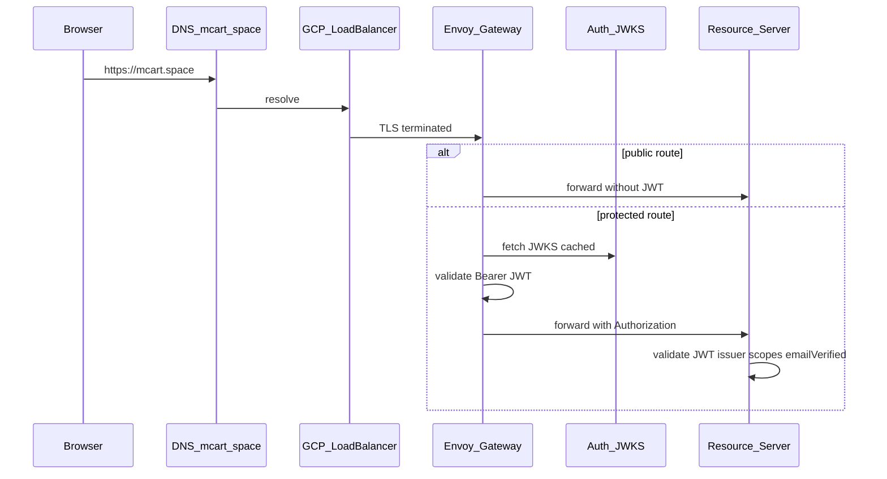

**Talking points:** Defense in depth — edge JWT **and** service resource servers. S2S calls forward the **user** Bearer token (not mTLS / client credentials). Fold into Case Study 5 platform chapter — not a standalone JWT case study.

---

## Diagram 10 — Deployment as-built (**Implemented**)

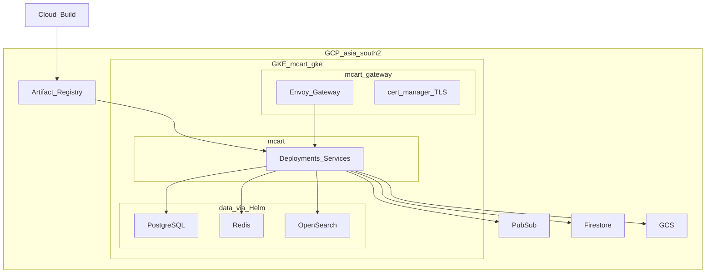

**Honesty:** No HPA manifests in repo (**Designed but not currently implemented**). Always-on cost ~₹2,000/day — Case Study 5. Namespaces are `mcart` + `mcart-gateway`, not diagram labels `core-services` / `gateway`.

---

## Diagram 11 — Transaction boundary (**Implemented**)

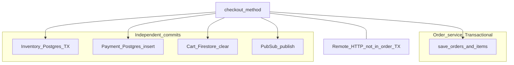

**Talking points:** `@Transactional` on checkout only covers order Postgres. Holding the connection across remote HTTP is an anti-pattern and creates failure windows (Diagram 5).

---

## Diagram 12 — Inventory stock writers (**Implemented** problem)

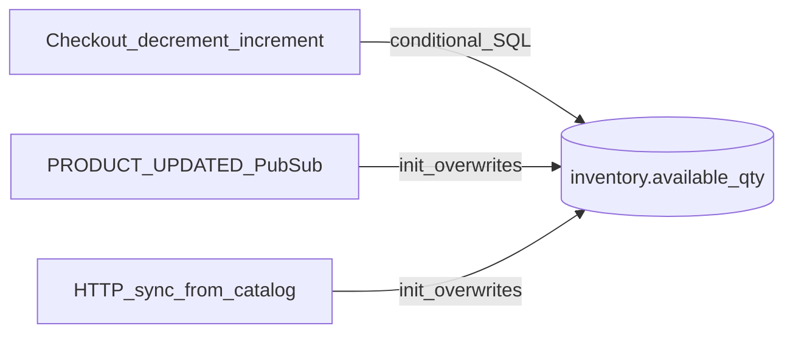

**Case Study 2 punchline:** Three writers to the same field. Checkout deductions can be clobbered by catalog sync.

---

## Diagram 13 — Pub/Sub topology (**Implemented**)

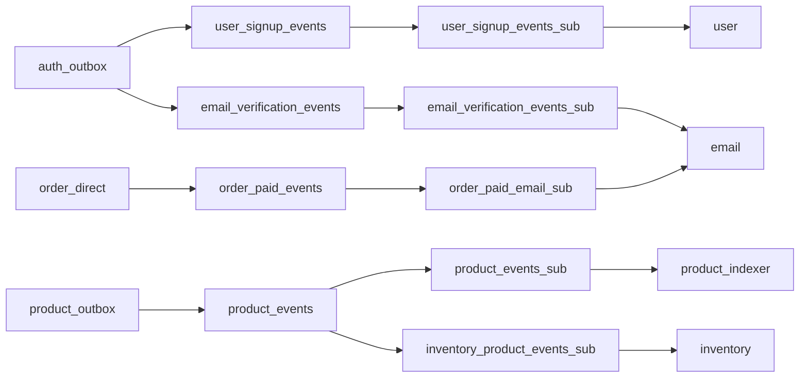

**Honesty:** No dead-letter subscriptions in Terraform (**Designed but not currently implemented**).

---

## Diagram 14 — CI/CD as-built (**Implemented** partial)

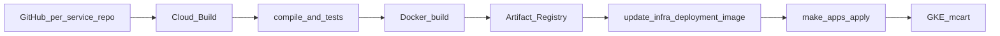

**Honesty:** SonarQube and multi-env promotion gates are **Designed but not currently implemented** in all pipelines. One repo per service is **Implemented**.

---

## Deck order suggestion (15 minutes)

1. Diagram 1 — context  
2. Diagram 2 — service map  
3. Diagram 3 — sync vs async  
4. Diagram 4 + 5 — checkout depth  
5. Diagram 7 — search pipeline credibility  
6. Diagram 9 + 10 — security and delivery  
7. Close with Case Study 1 opening sentence from PART 12.4  

---

## Next documentation step

After these diagrams: **Case Study 1 client draft** (resilient checkout) using Diagrams 4, 5, and 11.

See [modernization-assessment.md](modernization-assessment.md) §12.5 ordered immediate steps.
