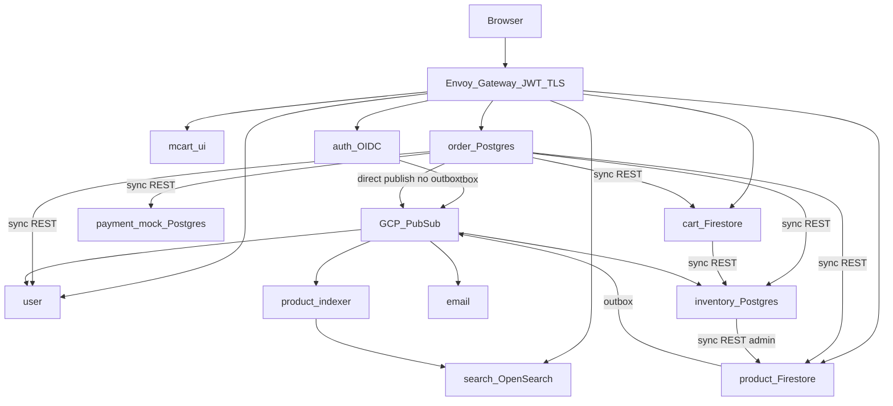
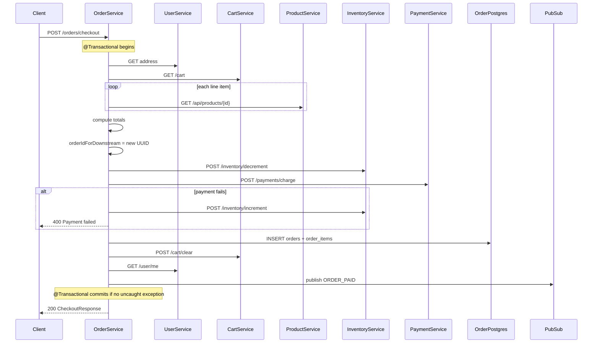

# MCART Portfolio and Modernization Assessment

**Document status:** Phase 0 baseline assessment  
**Platform:** MCART reference e-commerce platform  
**Workspace:** `/home/shivam-sharma/project/ecommerce`  
**Last updated:** September 2026

This document is the factual architecture assessment for turning MCART into a consultancy flagship portfolio. It distinguishes what exists in code from what exists only in design documents or as proposed modernization.

### Honesty labels used throughout

| Label | Meaning |
|-------|---------|
| **Implemented** | Verified in repository source or infrastructure manifests |
| **Designed but not currently implemented** | Appears in diagrams or service docs but not in code |
| **Proposed modernization** | Recommended future engineering work |
| **Simulated scenario** | Demo/mock behavior (e.g. mock payment) |
| **Not yet measured** | Metric defined but no benchmark run |
| **Insufficient evidence — requires verification** | Cannot be claimed without a runtime test |

---

## PART 1 — Executive Assessment

**Verdict: Yes — MCART is strong enough to become the consultancy’s flagship reference platform**, provided we describe it honestly as a *reference modernization scenario*, not a fictional production legacy migration.

### What makes it credible today (**Implemented**)

- **Independent microservices:** Eleven Java/Spring Boot services plus Angular SSR UI, each with its own Dockerfile, Cloud Build pipeline, and Kubernetes deployment manifests.
- **Real bounded contexts and polyglot persistence:** PostgreSQL (auth, user, inventory, payment, order), Firestore (product, cart), OpenSearch (search index), Redis (auth, email dedupe), GCS (product images).
- **Real security architecture:** Spring Authorization Server with OIDC discovery and JWKS; OAuth2 resource servers on protected APIs; Envoy Gateway edge JWT validation and TLS via cert-manager.
- **Real event-driven integration:** Transactional outbox in auth (Postgres) and product (Firestore); GCP Pub/Sub for signup, catalog sync, and order-paid email.
- **Real cloud-native delivery:** Terraform (GCP), Helm (Postgres, Redis, OpenSearch), GKE, Gateway API, Workload Identity.

### What would undermine credibility

- Calling it a “production legacy platform” or inventing outages, revenue impact, or SLA improvements.
- Labeling current checkout as a Saga, Kafka deployment, or hosted payment integration when code shows otherwise.
- Replacing GCP Pub/Sub with Kafka solely to list Kafka on a technology slide.

### Accurate baseline label

> **Hybrid microservices** — mostly synchronous HTTP on the commerce path, with limited Pub/Sub choreography around identity, catalog indexing, inventory sync, and email. Not a monolith. Not a fully event-driven platform.

---

## PART 2 — Actual Current Architecture

### Service inventory (**Implemented**)

| Service | Role | Primary data store |
|---------|------|-------------------|
| `ecommerce-auth` | Identity, OAuth2/OIDC issuer, signup/login | PostgreSQL + Redis |
| `ecommerce-user` | Profiles, shipping addresses | PostgreSQL |
| `ecommerce-product` | Catalog CRUD, GCS images, outbox | Firestore + GCS |
| `ecommerce-product-indexing` | Search index sync | OpenSearch (write) |
| `ecommerce-search` | Product search API | OpenSearch (read) |
| `ecommerce-cart` | Shopping cart | Firestore |
| `ecommerce-inventory` | Stock levels | PostgreSQL |
| `ecommerce-payment` | Mock payment processor | PostgreSQL |
| `ecommerce-order` | Checkout orchestration, order history | PostgreSQL |
| `ecommerce-email` | SMTP notifications (Pub/Sub consumers) | Redis (dedupe only) |
| `ecommerce-ui` | Angular 20 SSR storefront | None |
| `ecommerce-infra` | Terraform, Helm, K8s, gateway | GCP |
| `ecommerce-docs` | Architecture diagrams (not runnable) | N/A |

Each microservice directory contains its own Git repository. Default HTTP ports are documented in [`ecommerce-infra/docs/00-system-overview.md`](../ecommerce-infra/docs/00-system-overview.md).

### Architecture diagram (**Implemented** baseline)



**Note:** Payment and email are **not** exposed on Envoy HTTPRoutes — they are cluster-internal or Pub/Sub-driven only.

### Communication patterns

#### Synchronous REST (**Implemented**)

| Caller | Callee | Purpose |
|--------|--------|---------|
| Browser / UI | Gateway → auth, user, product, search, cart, order | Customer and admin flows |
| Cart | Inventory | Stock lookup (Bearer token forwarded) |
| Order | User, cart, product, inventory, payment | Checkout orchestration |
| Inventory | Product | Admin catalog sync (`CatalogInventorySyncService`) |

HTTP clients use Spring `RestClient` with **no configured timeouts, retries, or circuit breakers** (`DownstreamClients.java`, `InventoryClient.java`).

#### Asynchronous Pub/Sub (**Implemented**)

| Topic | Publisher | Consumers |
|-------|-----------|-----------|
| `user-signup-events` | Auth outbox | User service |
| `email-verification-events` | Auth outbox | Email service |
| `product-events` | Product outbox | Product-indexer, inventory |
| `order-paid-events` | Order service (direct publish) | Email service |

**Kafka is not used anywhere in this repository.**

#### Transactional outbox (**Implemented** partial)

| Service | Outbox store | Published topics |
|---------|--------------|------------------|
| Auth | PostgreSQL `outbox_event` | `user-signup-events`, `email-verification-events` |
| Product | Firestore `outbox_events` | `product-events` |
| Order | **None** | Direct `PubSubTemplate.publish` after checkout |

### Payment (**Simulated scenario**)

The payment service is a **mock payment provider for demonstration purposes**. It supports modes `success`, `fail`, and `random` via `payment.mock.mode`, with configurable `payment.mock.delay-ms` (default **800ms** in YAML). Status values are `SUCCESS` or `FAILED` only. There is **no refund API**, no payment state machine, and **no unique constraint** on `payments.order_id`.

### Auth and security (**Implemented**)

- Spring Authorization Server: `/.well-known/openid-configuration`, `/oauth2/jwks`
- Custom REST login/signup at `/auth/login`, `/auth/signup`
- JWT access tokens (RSA); refresh tokens in HttpOnly cookie stored in Redis
- Argon2 password hashing
- Scope-based admin authorization (`SCOPE_product.admin`, `SCOPE_reindex`)
- Service-to-service: **user Bearer token passthrough** (not mTLS or client credentials)

### Observability (**Implemented** minimal)

- Spring Boot Actuator health/readiness/liveness probes on Kubernetes deployments
- SLF4J application logging
- **Not implemented:** Prometheus metrics, distributed tracing, correlation IDs, Resilience4j

### Tests (**Implemented** thin)

Order, payment, and inventory services have **no test sources**. Most other services have smoke/`ApplicationTests` only. User service has modest controller/service tests.

### Local development (**Implemented** manual)

Documented in [`local setup ecommerce.txt`](../local%20setup%20ecommerce.txt): manual Docker containers for Postgres/Redis, Flyway migrations, per-service `bootRun`. **No docker-compose.** Local profiles typically connect to **real GCP** Pub/Sub and Firestore.

### Runtime versions (**Implemented**)

| Component | Version |
|-----------|---------|
| Product, product-indexer | Spring Boot 3.2.5 (WebFlux) |
| Most other Java services | Spring Boot 4.0.2 |
| Java | Mixed 17 and 21 |
| UI | Angular 20 SSR |

This mix is an operational note, not a portfolio case study.

---

## PART 3 — Documentation vs Implementation Gap

### Gap matrix

| Area | Exists in code | Exists in docs | Gap | Modernization opportunity |
|------|----------------|----------------|-----|---------------------------|
| Checkout orchestration | Yes (sync HTTP) | Yes (also async Razorpay flow) | Docs show hosted PSP + webhooks | Saga + mock state machine |
| Kafka | No | Mentioned in role brief only | N/A | **Do not add** — use Pub/Sub |
| Outbox | Yes (auth, product) | Yes | Order publishes without outbox | Order outbox for `ORDER_PAID` |
| Idempotency | Partial (email dedupe) | Implied for payment | No checkout/payment idempotency | Idempotency keys + DB constraints |
| Payment refund | No | Aspirational in diagrams | Yes | Mock refund for saga demo |
| DLQ | No | Yes (search sequence) | Yes | Terraform dead-letter subscriptions |
| Observability | Probes + logs only | Tracing, metrics aspirational | Yes | OpenTelemetry + demo dashboards |
| Kubernetes HPA | No | Yes (deployment diagram) | Yes | Optional after load measurement |
| Search Redis cache | No | Yes (product-search sequence) | Yes | Not required for portfolio |
| Saga | No (manual increment only) | order.md says "saga" | Mislabel | Formal saga state machine |
| Signup flow | Outbox → Pub/Sub | Sync gateway → user HTTP | Diagram outdated | Update diagrams (see errata) |
| `eventId` in product events | In Firestore outbox only | Implied idempotent consumer | Omitted from Pub/Sub payload | Include in published message |
| Auth outbox FAILED rows | markFailed(), no retry | Retry implied | Yes | FAILED-row requeue or DLQ |

### Largest honesty gaps

1. **`checkout-flow.txt`** — Designed but not currently implemented: Razorpay redirect, webhook, event-bus order update. **Implemented:** synchronous mock charge in `OrderService.checkout`.
2. **Architecture draw.io** — Designed but not currently implemented: shipment service, fraud API, dedicated admin microservice, analytics, WAF.
3. **Deployment draw.io** — Partial mismatch: HPA, `asia-south1`, namespace `core-services`. **Implemented:** `asia-south2`, namespaces `mcart` + `mcart-gateway`, no HPA manifests.
4. **`search-indexing-sync-flow.txt`** — DLQ and Elasticsearch branding. **Implemented:** OpenSearch, no DLQ in Terraform.
5. **`ecommerce-infra/docs/services/order.md`** — Calls checkout a "saga". **Implemented:** synchronous orchestrator with one compensating HTTP increment.

See [`diagram-errata.md`](diagram-errata.md) for a full artifact-by-artifact comparison.

---

## PART 4 — Baseline / "Before" Architecture

### Classification

**Is it a monolith, synchronous microservices, hybrid microservices, or something else?**

> **Hybrid microservices** — independently deployable services with database-per-service, significant synchronous coupling on checkout, and partial event-driven coordination for identity, catalog, and notifications.

It is **not** a monolith. It is **not** a false "bad monolith → microservices" story.

### Accurate transformation narrative

```text
Existing microservices
+ Synchronous service coupling on checkout
+ Partial event-driven processing (auth, catalog, email)
+ Incomplete distributed transaction handling
+ Limited resilience and observability
        |
        v  (Proposed modernization)
Modernized hybrid architecture
+ Event-driven critical workflows where justified
+ Orchestration saga for checkout
+ Compensation, idempotency, outbox
+ Retry/DLQ on async paths
+ Observability and failure injection for demos
```

### Transaction boundaries (**Implemented**)

| Operation | Transaction scope |
|-----------|-------------------|
| Inventory decrement/increment | Local Postgres in inventory service (`@Transactional`) |
| Payment charge | Local Postgres insert in payment service (no `@Transactional` wrapper) |
| Order persist | Local Postgres in order service (`@Transactional` on entire checkout method) |
| Product/cart mutations | Firestore |
| Pub/Sub publish | Independent of any DB transaction |

**Critical insight:** `@Transactional` on `OrderService.checkout` covers **only** the order service JDBC connection. Remote HTTP calls to inventory, payment, and cart commit in their own stores independently. Holding the Postgres transaction open across remote I/O is an anti-pattern.

### Coupling summary

| Coupling type | Where |
|---------------|-------|
| Temporal | Checkout waits synchronously for inventory, payment, cart |
| Availability | Order checkout fails if any downstream HTTP service is unavailable |
| Data | Catalog `stockQuantity` and inventory `available_qty` can diverge |

---

## PART 5 — Current Checkout Deep Dive

**Status:** **Implemented** — analyzed from `ecommerce-order/src/main/java/com/mcart/order/service/OrderService.java`

### Current sequence diagram



### Step classification

| Step | Type | In order DB TX? | Commits independently? |
|------|------|-----------------|--------------------------|
| Resolve address | Sync HTTP | No local write | N/A |
| Get cart | Sync HTTP | No | Firestore (cart service) |
| Get products | Sync HTTP | No | N/A |
| Calculate prices | In-memory | No | N/A |
| Decrement inventory | Sync HTTP | No | Yes (inventory Postgres) |
| Charge payment | Sync HTTP | No | Yes (payment Postgres) |
| Increment inventory (compensation) | Sync HTTP compensation | No | Yes |
| Persist order + items | Local DB | Yes | On TX commit |
| Clear cart | Sync HTTP | No | Yes (Firestore) |
| Get email | Sync HTTP | No | N/A |
| Publish ORDER_PAID | Async Pub/Sub | No | Yes (Pub/Sub) |

### Existing compensation

**Implemented:** Payment failure (HTTP error or status ≠ SUCCESS) triggers `incrementInventory` before throwing `CheckoutFailedException`.

**Not implemented:** Refund on payment-success-then-order-failure; compensation if increment itself fails; saga state tracking.

### Failure scenario analysis

| # | Scenario | Resulting state | Current handling | Problem |
|---|----------|-----------------|------------------|---------|
| 1 | Inventory OK → payment FAIL | Stock decremented then restored | Increment attempted | If increment fails, stock stuck down |
| 2 | Inventory OK → payment timeout | Ambiguous | Treated as payment fail if exception thrown | Payment may have committed; double charge on retry |
| 3 | Payment OK → order persist FAIL | Charged, stock down, no order | 500, no compensation | Orphaned payment + inventory |
| 4 | Order saved → cart clear FAIL | Charged, stock down, no order (TX rollback) | 500 | Worse than partial success |
| 5 | Event publish FAIL | Order exists, no email | Error logged, checkout succeeds | Dual-write without outbox |
| 6 | Duplicate checkout click | Double decrement/charge possible | None | No idempotency key |
| 7 | Duplicate payment request | Multiple payment rows | None | No UNIQUE on `order_id` |
| 8 | Inventory unavailable | Checkout aborts | 500 if before payment | OK if before decrement |
| 9 | Payment unavailable | Checkout aborts after decrement | Compensation attempted | Same as scenario 1 |
| 10 | Crash mid-checkout | Depends on crash point | No recovery | See crash matrix below |

**Crash matrix (order service process):**

| Crash after | Inventory | Payment | Order PG | Cart |
|-------------|-----------|---------|----------|------|
| Decrement | Decremented | None | Uncommitted | Unchanged |
| Payment SUCCESS | Decremented | SUCCESS row | Uncommitted | Unchanged |
| Order save | Decremented | SUCCESS | Uncommitted | Unchanged |
| Cart clear HTTP success | Decremented | SUCCESS | Rolls back on crash | **Cleared** |
| Method return | Decremented | SUCCESS | **Committed** | Cleared |

### Two order identifiers (**Implemented**)

- `orderIdForDownstream` — UUID generated at checkout start; passed to payment and inventory; **not stored** on `orders` table.
- `orders.order_id` — Postgres PK generated at persist time; used in `ORDER_PAID` event and email dedupe.

No foreign key links these identifiers.

### Catalog/inventory stock conflict (**Implemented** bug-class)

Two paths overwrite `inventory.available_qty` from catalog `stockQuantity`:

1. Pub/Sub `PRODUCT_UPDATED` → `ProductPubSubEventHandler` → `inventoryService.init(...)`
2. HTTP admin `POST /inventory/admin/sync-from-catalog` → `CatalogInventorySyncService`

Either can **clobber checkout deductions**. This is a real engineering problem suitable for Case Study 2.

---

## PART 6 — Modernization Opportunities (Ranked)

### High priority

| Opportunity | Why |
|-------------|-----|
| Checkout distributed consistency | Multiple resource managers, incomplete compensation, no idempotency, `@Transactional` misleading |
| Catalog vs inventory stock ownership | Two writers to stock; events overwrite checkout deductions |
| Observability + failure injection | Required for credible demos; almost absent today |
| Cost-conscious demo environments | ~₹2,000/day always-on GKE; no compose; local depends on GCP |

### Medium priority

| Opportunity | Why |
|-------------|-----|
| Search pipeline hardening | Best existing EDA pattern; needs DLQ, eventId, poison policy |
| Auth outbox FAILED-row handling | Pattern exists; failed rows not retried |
| Security deepening | RestClient timeouts, S2S identity, secret hygiene |
| K8s consistency | HPA documented not implemented; uneven probe/resource configs |

### Low priority / do not pursue for portfolio

- Kafka migration (Pub/Sub is sufficient and **Implemented**)
- Making all calls async (UI needs sync product/cart/order)
- Real payment gateway (mock is adequate if labeled)
- CQRS, Event Sourcing, Temporal, service mesh without a specific problem
- Rebuilding auth/outbox (already demonstrates the pattern well)

---

## PART 7 — Recommended Case Studies (5)

### Case Study 1: Modernizing Distributed Checkout for Resilient Order Processing

| Field | Detail |
|-------|--------|
| **Status** | **Proposed modernization** |
| **Business problem** | Checkout spans inventory, payment, and order stores without atomic guarantees; failures can leave inconsistent state (charged without order, stock reduced without sale). |
| **Baseline** | Synchronous orchestrator in order service (**Implemented**) |
| **Root cause** | Multiple autonomous transaction boundaries; `@Transactional` does not span remote calls; compensation limited to payment-fail → inventory increment |
| **Options considered** | (1) Keep sync + stronger idempotency; (2) Choreography via events; (3) **Orchestration saga in order service** |
| **Decision** | **Orchestration** — order already coordinates; customer needs single outcome; compensation visibility in one workflow |
| **Keep synchronous** | UI → Order (immediate accept/reject or `PENDING`) |
| **Make asynchronous** | Email (already async); optional async payment capture/timeout handling |
| **Technologies** | Existing Pub/Sub (not Kafka), Postgres saga state, mock payment state machine, inventory reservation |
| **Payment mock states** | `INITIATED`, `SUCCEEDED`, `FAILED`, `TIMEOUT`, `REFUND_REQUESTED`, `REFUNDED` (**Simulated scenario**) |
| **Patterns** | Saga state machine, inventory reservation, idempotency keys, transactional outbox for events |
| **Failure scenarios** | All ten scenarios in Part 5, with demo injection |
| **Implementation changes** | `OrderService`, `PaymentService`, `InventoryService`, new saga/order state tables, outbox in order |
| **Testing** | Unit (state transitions), integration (Testcontainers), failure injection, contract tests |
| **Metrics** | **Not yet measured** — compensation success rate, duplicate checkout rate, p99 checkout latency |
| **Demo** | Checkout failure simulator (Demo 2) |

### Case Study 2: Keeping Catalog, Inventory, and Search Consistent Without a Shared Database

| Field | Detail |
|-------|--------|
| **Status** | **Proposed modernization** (problem **Implemented** today) |
| **Business problem** | Catalog, inventory, and search index represent the same products but use different stores; catalog events can overwrite live stock counts. |
| **Baseline** | Product outbox → Pub/Sub → indexer + inventory `init` (**Implemented**) |
| **Root cause** | Two writers to stock semantics; inventory treats catalog `stockQuantity` as authoritative on UPDATE |
| **Decision** | Catalog events create/delete rows and update metadata; **never overwrite `available_qty` on UPDATE**; stock changes only via reservation APIs |
| **Technologies** | Existing Firestore outbox, Pub/Sub, OpenSearch indexer |
| **Demo** | Admin updates product; show search lag; show inventory not clobbered after checkout (**Proposed**) |

### Case Study 3: Hardening the Product → Index Pipeline for At-Least-Once Delivery

| Field | Detail |
|-------|--------|
| **Status** | **Proposed modernization** (baseline pipeline **Implemented**) |
| **Business problem** | Search results can lag or diverge from catalog; poison messages can retry indefinitely without DLQ. |
| **Baseline** | Outbox + Pub/Sub + version-aware indexer + admin reindex (**Implemented**) |
| **Gaps** | No `eventId` in Pub/Sub payload; no DLQ in Terraform; malformed messages nack forever |
| **Decision** | Add eventId, DLQ subscriptions, poison ack policy, document replay |
| **Metrics** | **Not yet measured** — indexing lag, DLQ depth, reindex duration |
| **Demo** | Catalog → index lag and recovery (Demo 3) |

### Case Study 4: Making Resilience Visible — Observability and Failure Injection

| Field | Detail |
|-------|--------|
| **Status** | **Proposed modernization** |
| **Business problem** | Distributed failures are invisible; cannot demonstrate reliability engineering to clients. |
| **Baseline** | Logs + K8s probes only (**Implemented**) |
| **Decision** | Correlation IDs, OpenTelemetry traces, saga/messaging metrics; demo fault API behind profile (extend `payment.mock.mode`, add inventory faults) |
| **Demo** | Fold traces into checkout failure simulator |

### Case Study 5: Cost-Conscious Cloud-Native Delivery of a Multi-Service Platform

| Field | Detail |
|-------|--------|
| **Status** | **Proposed modernization** (GKE stack **Implemented**) |
| **Business problem** | Full platform on GKE ~₹2,000/day; portfolio cannot depend on 24/7 cluster. |
| **Baseline** | Terraform + Helm + GKE + Gateway + Cloud Build (**Implemented**) |
| **Decision** | Hybrid: compose/emulators for dev; kind/k3d or ephemeral GKE for live demos; static site for portfolio |
| **Security chapter** | Fold OAuth2/gateway story here rather than standalone thin JWT case study |
| **Demo** | Start/stop environment (Demo 4) |

---

## PART 8 — Recommended Demos (4)

### Demo 1: Full Customer Journey (2–3 min)

| Field | Detail |
|-------|--------|
| **Objective** | Prove the platform is a real e-commerce application |
| **Audience** | Business stakeholders, CTO intro |
| **Scenario** | Signup → verify email → browse → search → cart → checkout success |
| **Services** | auth, user, email, product, search, cart, inventory, payment, order, UI |
| **Infrastructure** | Local compose or ephemeral cluster |
| **Cost** | ₹0 (local) or few hours GKE |
| **Format** | Live or recorded |
| **Proves** | End-to-end hybrid microservices work |

**Script:**

```text
00:00  Open mcart UI
00:20  Sign up new user
00:45  Verify email (show inbox or log)
01:00  Search products, open detail
01:20  Add to cart
01:40  Checkout with address
02:00  Order confirmation + receipt email
02:30  Show order history
```

### Demo 2: Checkout Failure Simulator (4–5 min)

| Field | Detail |
|-------|--------|
| **Objective** | Demonstrate distributed transaction problems and proposed saga solution |
| **Audience** | Engineering leaders, architects |
| **Scenario** | Inject payment fail, timeout, duplicate click; show compensation and (after Phase 3) saga state |
| **Services** | order, inventory, payment, UI |
| **Infrastructure** | Local with `payment.mock.mode=fail|random`, delay injection |
| **Failure demonstrated** | Scenarios 1, 2, 6 from Part 5 |
| **Format** | **Live** (core differentiator) |
| **Proves** | Why checkout modernization matters |

**Script (baseline — current behavior):**

```text
00:00  Add items to cart
00:30  Checkout with payment.mock.mode=success — show success
01:00  Set payment.mock.mode=fail — checkout fails, show inventory restored
01:30  Set payment.mock.mode=success + duplicate click — show double charge risk
02:00  Explain failure windows (payment OK, cart clear fail)
02:30  (Future) Show saga state table and compensation log
```

### Demo 3: Catalog → Index Lag and Recovery (3 min)

| Field | Detail |
|-------|--------|
| **Objective** | Make eventual consistency visible |
| **Audience** | Architects, search/indexing buyers |
| **Scenario** | Admin updates product → search lags → stop indexer → DLQ/reindex → catch up |
| **Services** | product, product-indexer, search |
| **Infrastructure** | Pub/Sub + OpenSearch |
| **Format** | Live or recorded |
| **Proves** | Event-driven indexing with recovery path |

**Script:**

```text
00:00  Search for product (baseline hit count)
00:30  Admin updates product name/price
00:45  Search again — show lag (< few seconds normally)
01:00  Stop product-indexer pod
01:15  Update product again (event queued)
01:30  POST /product-indexer/admin/reindex
02:00  Search shows updated catalog
```

### Demo 4: Start/Stop Demo Environment (2 min)

| Field | Detail |
|-------|--------|
| **Objective** | Prove cost-conscious delivery without sacrificing architectural credibility |
| **Audience** | Founders, ops-conscious clients |
| **Scenario** | `docker compose up` or `kind create cluster` → health checks → teardown |
| **Format** | Recorded for website; live once for credibility |
| **Proves** | Portfolio does not require ₹2,000/day always-on cluster |

---

## PART 9 — Implementation Roadmap

**Phase 0 — Baseline freeze** (**In progress** — this document)

- Honesty matrix and gap analysis
- Diagram errata
- Secret hygiene documentation
- PART 12 current-architecture content package (CTO writeups, demos, diagrams, case-study framing)
- As-built diagrams 1–14 ([as-built-diagrams.md](as-built-diagrams.md)) — **Done**
- Next doc step: Case Study 1 client draft
- No application code changes until Phase 1 approved

**Phase 1 — Payment mock state machine + idempotent charge** (**Proposed modernization**)

- Payment states, UNIQUE constraint on `(order_id, idempotency_key)` or similar
- Mock refund endpoint

**Phase 2 — Inventory reservation** (**Proposed modernization**)

- Reserve / confirm / release API
- Stop catalog events from overwriting `available_qty` on UPDATE

**Phase 3 — Order saga state + sync API** (**Proposed modernization**)

- `PENDING` / `PAID` / `FAILED` order status
- Saga state table; shrink `@Transactional` scope

**Phase 4 — Idempotency keys** (**Proposed modernization**)

- Checkout `Idempotency-Key` header
- Processed-event tracking

**Phase 5 — Order outbox** (**Proposed modernization**)

- Transactional outbox for `ORDER_PAID` and saga commands

**Phase 6 — Pub/Sub DLQ + poison policy + eventId** (**Proposed modernization**)

- Terraform DLQ subscriptions
- Include `eventId` in product event payload

**Phase 7 — Observability + demo fault API** (**Proposed modernization**)

- OpenTelemetry, correlation IDs, metrics
- Demo profile fault injection

**Phase 8 — Docker Compose / emulators + recorded demos** (**Proposed modernization**)

- Local stack without always-on GCP
- Record Demos 2–4

**Phase 9 — Portfolio website** (**Proposed modernization**)

- Case study pages, videos, GitHub links
- Static hosting; no cluster dependency

---

## PART 10 — Cost Strategy

Approximate always-on GKE cost: **~₹2,000/day** (operator estimate). Portfolio design must not assume 24/7 production-like environment.

| Mode | Strategy | Cost profile |
|------|----------|--------------|
| **Development** | Docker Compose + Postgres/Redis/OpenSearch + Pub/Sub and Firestore emulators | ~₹0 cloud |
| **Recording** | Same local stack; screen-record Demos 2–4 | ~₹0 cloud |
| **Client live demo** | kind/k3d locally **or** ephemeral GKE for 2–4 hours then destroy per `CLOUD_SHELL_DEPLOYMENT.md` | Hours, not days |
| **Portfolio website** | Static hosting: case studies, diagrams, embedded videos, GitHub links | Minimal monthly |
| **Production-like GKE** | On-demand only; do not keep `mcart.space` running for portfolio | Budget-controlled |

**Principle:** GKE/Gateway/Terraform credibility is shown in **recordings and occasional live spin-up**, not continuous operation.

---

## PART 11 — Portfolio Structure

Present as **one platform, five engineering problems**:

```text
                 MCART REFERENCE PLATFORM
                              |
          +-------------------+-------------------+
          |                   |                   |
          v                   v                   v
   Case Studies            Demos              Source Code
          |
    +-----+------+---------+---------+---------+
    |            |         |         |         |
    v            v         v         v         v
 Checkout    Catalog/   Search    Observ-   Cost-conscious
 Saga        Inventory  Pipeline  ability   Cloud delivery
             consistency hardening
```

### Website sections

| Section | Content |
|---------|---------|
| **Platform** | Hybrid microservices overview; honesty about reference scenario |
| **Case Studies** | Five studies above with problem → decision → outcome framing |
| **Demos** | Scripts + embedded recordings |
| **Architecture** | Baseline vs target diagrams; Implemented vs Proposed labels |
| **Technology** | Only what is used; mock payment disclaimer prominent |
| **GitHub** | Service repos; transparent about assignment origin |
| **Documentation** | This assessment, infra docs, [diagram errata](diagram-errata.md) |

### Language guidelines

**Use:**

> "The checkout workflow was redesigned around asynchronous domain events to reduce temporal coupling between order processing and downstream services while allowing each bounded context to manage its own transaction boundary."

**Avoid:**

> "We used Kafka because Kafka is popular."

**Never manufacture:** production incidents, customer data, performance numbers, revenue impact, SLA improvements, migration history.

---

## PART 12 — Current Architecture Content Package (CTO-Facing)

**Audience:** prospective clients / CTOs. Treat the **current architecture as the product**. Modernization case studies are engineering problems *extracted from that product*, not a technology shopping list.

**Rule:** Keep future work in appendices or sections labeled **Proposed**. The CTO first sees what exists and which problems it honestly has.

### 12.1 What to write (As-Built Architecture Guide)

| Section | Content | Status |
|---------|---------|--------|
| **A. One-page executive brief** | What MCART is; domains covered; hybrid style in one sentence; honesty line (mock payment, not monolith, not Kafka); why it matters to a client | Covered in PART 1 |
| **B. System context** | External actors (browser, SMTP, GCP); edge (Envoy, TLS, JWT); domains Identity / Catalog & Search / Commerce / Platform; payment + email cluster-internal | [as-built-diagrams.md](as-built-diagrams.md) Diagram 1 |
| **C. Service catalog** | Purpose, API surface, datastore, sync vs async, deployability | PART 2 service inventory |
| **D. Communication & consistency** | Intentional sync vs async; consistency table | PART 2 + Appendix B |
| **E. Data ownership** | Who owns which store; Auth vs User; Product vs Inventory vs Search; Order vs Payment two IDs | PART 4–5 + Diagram 8 |
| **F. Checkout as-built** | Sequence, `@Transactional` scope, compensation, failure windows, mock disclaimer | PART 5 |
| **G. Auth & edge security** | OIDC, JWKS, edge JWT, scopes, token passthrough limitation | PART 2 auth; Diagram 9 |
| **H. Catalog / search as-built** | Outbox → Pub/Sub → indexer; version skip; reindex; inventory consuming product events + stock overwrite risk | PART 3–6 + Diagrams 7, 12 |
| **I. Platform / ops** | Terraform, Helm, GKE, Cloud Build, probes; ~₹2k/day; local = manual Docker + GCP | PART 10 + Diagram 10 |
| **J. Explicit “not in code” errata** | Razorpay, HPA, DLQ, Redis search cache, shipment/fraud | [diagram-errata.md](diagram-errata.md) |

### 12.2 Diagrams to draw (as-built only)

Draw diagrams that match code. Keep aspirational draw.io files but mark them **Target / Design Intent**.

#### Must-have (CTO deck)

| # | Diagram | Shows | Case study / use |
|---|---------|-------|------------------|
| 1 | System context | Browser, Gateway, domains, GCP | Opening slide |
| 2 | Container / service map | Microservices + datastores | Core architecture |
| 3 | Sync vs async overlay | Solid = REST, dashed = Pub/Sub | Hybrid story |
| 4 | Checkout sequence (as-built) | Order → User/Cart/Product/Inv/Pay → DB → Pub/Sub | Case Study 1 |
| 5 | Checkout failure windows | Failure marks on swimlanes | Case Study 1 demo |
| 6 | Signup / outbox sequence | Auth DB + outbox → Pub/Sub → user + email | Outbox credibility |
| 7 | Product → index sequence | Firestore outbox → Pub/Sub → indexer → OpenSearch | Case Study 3 |
| 8 | Data ownership map | Boxes per store, write arrows | Case Study 2 |
| 9 | Edge security | TLS → Envoy JWT → service JWT / scopes | Platform chapter |
| 10 | Deployment as-built | Namespaces `mcart` / `mcart-gateway`, Helm data | Case Study 5 |

#### Nice-to-have

| # | Diagram | Why |
|---|---------|-----|
| 11 | Transaction boundary | Local TX ≠ distributed TX for CTOs |
| 12 | Inventory stock writers | Catalog event + admin sync vs checkout decrement |
| 13 | Pub/Sub topology | Topics / subscriptions |
| 14 | CI/CD as-built | GitHub → Cloud Build → Artifact Registry → GKE |

**Do not draw as “current”** unless labeled otherwise: Razorpay/webhook checkout, Kafka bus, HPA everywhere / multi-region, Redis in front of search, separate shipment/fraud/admin microservices.

**If time is limited, draw these three first:** (1) service map + datastores, (2) checkout sequence as-built, (3) product outbox → search. Then Demo A + Demo B.

Canonical mermaid sources: [as-built-diagrams.md](as-built-diagrams.md).

### 12.3 Demos from current behavior

Prioritize demos that need **almost no new code**. Label mock payment: *Payment provider simulated for demonstration purposes.*

| Demo | Name | Length | Proves | Format |
|------|------|--------|--------|--------|
| **A** | Platform proof — customer journey | 2–3 min | Real system, not slides | Live or recorded (always first for CTOs) |
| **B** | Distributed checkout reality | 4–5 min | Failure understanding + compensation that works today | **Live** flagship; also record |
| **C** | Eventual consistency of search | 3 min | Outbox + Pub/Sub + OpenSearch | Live or recorded |
| **D** | Identity reliability (outbox) | ~2 min | Transactional outbox **Implemented** | Optional live |
| **E** | Edge security | ~1 min | Gateway + OIDC | Optional live |
| **F** | Cost / ops start-stop | ~2 min | Operator mindset; no 24/7 cluster needed | Recorded |

**Demo B script (current behavior only):**

```text
00:00  Happy path — payment.mock.mode=success
00:30  mode=fail — show inventory restored (compensation that works)
01:00  Double-click / retry — explain double-charge risk (no idempotency)
01:30  Whiteboard — payment OK then order/cart failure window
02:00  Close — this is the baseline Case Study 1 modernizes
```

**Recording strategy:** A + B + C on the website; live B for sales calls. Website must not require always-on cluster.

### 12.4 How to describe case studies from current architecture

```text
As-built baseline (evidence)
        →
Real engineering problem visible in that baseline
        →
Options considered
        →
Decision / proposed target (clearly labeled Proposed)
        →
What we will implement / already implemented
        →
How we demo it
```

Never start with “We will introduce Kafka/Saga/OpenTelemetry.” Start with the **problem the current system exhibits**.

#### Case study framing template

1. **Title** — business outcome, not tech  
2. **Context** — “In our MCART reference platform…”  
3. **As-built** — 5–8 lines + one current diagram  
4. **Problem** — failure mode or coupling with evidence  
5. **Impact** — reliability / consistency / operability / cost (no fake numbers)  
6. **Options** — 2–3 alternatives  
7. **Decision** — what and why  
8. **Target architecture** — labeled **Proposed**  
9. **Demo** — what the viewer sees today vs after change  

#### Map current architecture → case studies

| Case study | Pull from current architecture | Opening sentence for CTO |
|------------|--------------------------------|---------------------------|
| **1. Resilient checkout** | `OrderService.checkout`, sync RestClient chain, weak compensation, two order IDs, no idempotency | “Checkout already spans five services and three databases; today only one failure path is compensated.” |
| **2. Catalog / inventory / search consistency** | Product outbox, inventory `init` on UPDATE, OpenSearch indexer | “Catalog, stock, and search are correctly separated stores — but catalog events can overwrite live stock.” |
| **3. Search pipeline reliability** | Outbox + Pub/Sub + version skip + reindex; missing DLQ/`eventId` | “We already run an event-driven indexing pipeline; the case study is hardening delivery semantics, not inventing search.” |
| **4. Observability / resilience visibility** | Logs + probes only; mock payment delay/fail already exist | “Failures are real; visibility is not. We make the same architecture debuggable and demoable.” |
| **5. Cost-conscious cloud delivery** | Real GKE/Terraform/Gateway + ₹2k/day + no compose | “The platform is cloud-native and expensive if left on; the case study is delivery strategy, not ‘using Kubernetes.’” |

**Security:** do **not** make a standalone “JWT case study.” Fold into Platform / Case Study 5 as a **capability chapter** (edge JWT, OIDC, scopes — **Implemented**), then optional S2S deepening as **Proposed**.

#### Language that works for CTOs

**Good:**

> “The platform is a hybrid microservice architecture. Checkout is intentionally synchronous for customer response latency, but that creates temporal and availability coupling across inventory and payment. We document the failure windows and a proposed orchestration saga.”

**Bad:**

> “Legacy monolith migrated to Kafka saga microservices.”

### 12.5 Recommended content package and immediate next steps

| Artifact | Format | Priority | Status |
|----------|--------|----------|--------|
| As-Built Architecture Guide (sections A–J) | This assessment + diagrams | **P0** | In progress |
| Diagrams 1–10 (must-have) | Mermaid in [as-built-diagrams.md](as-built-diagrams.md) | **P0** | **Done** (plus nice-to-have 11–14) |
| Diagram errata | [diagram-errata.md](diagram-errata.md) | **P0** | Done |
| Secret hygiene | [secret-hygiene.md](secret-hygiene.md) | **P0** | Done |
| Demo scripts A–C (recorded later) | Runbooks in PART 8 / §12.3 | **P0** | Scripts exist; recording TBD |
| Case Study 1 writeup (checkout) | 2–3 page client draft | **P0** | Outline in PART 7; full draft next after diagrams |
| Case Study 2 or 3 writeup | 2 pages | **P1** | Outline only |
| Case Study 5 (cost/platform) | 1–2 pages | **P1** | Outline only |
| Case Study 4 | After minimal tracing | **P2** | Outline only |

#### Ordered immediate steps (documentation-only until Phase 1 approved)

1. ~~**Publish as-built diagrams 1–10**~~ → [as-built-diagrams.md](as-built-diagrams.md) **Done**
2. **Write Case Study 1 client draft** from checkout as-built + failure windows ← **next**
3. **Expand Demo A/B into operator runbooks** (commands, env vars, what to show on screen)
4. **Record Demo A + B + C** for the static portfolio site
5. Only then start **Phase 1** application changes (payment state machine) if approved

---

## Appendix A — Event catalog (**Implemented**)

| Topic | eventType | Producer | Consumer |
|-------|-----------|----------|----------|
| `user-signup-events` | `USER_SIGNUP_COMPLETED`, `EMAIL_VERIFIED` | Auth outbox | User |
| `email-verification-events` | `SEND_VERIFICATION_EMAIL` | Auth outbox | Email |
| `product-events` | `PRODUCT_CREATED`, `PRODUCT_UPDATED`, `PRODUCT_DELETED` | Product outbox | Indexer, inventory |
| `order-paid-events` | `ORDER_PAID` | Order (direct) | Email |

---

## Appendix B — Data consistency classification

| Operation | Consistency model | Status |
|-----------|-------------------|--------|
| Order persist | Strong (local Postgres) | **Implemented** |
| Payment charge | Strong (local Postgres) | **Implemented** |
| Inventory decrement | Strong (local Postgres, conditional update) | **Implemented** |
| Cart read/write | Strong (Firestore per document) | **Implemented** |
| Search index | Eventual (seconds) | **Implemented** |
| Email receipt | At-least-once + idempotent dedupe (Redis) | **Implemented** |
| Cross-service checkout | **None** (best-effort compensation) | **Implemented** gap |

---

## Appendix C — Related documents

- [As-built diagrams](as-built-diagrams.md) — CTO must-have diagrams 1–14 (mermaid, code-accurate)
- [Diagram errata](diagram-errata.md) — artifact-by-artifact honesty guide
- [Secret hygiene](secret-hygiene.md) — credential handling for local setup
- [System overview](../00-system-overview.md) — operational service docs
- [Interview prep](../interview-prep-and-demo.md) — existing diagram vs code analysis

---

*This assessment reflects repository state at Phase 0. Metrics marked "Not yet measured" will be populated during implementation phases.*
